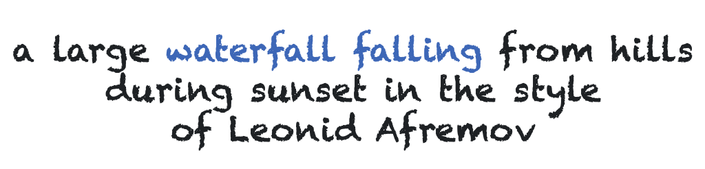
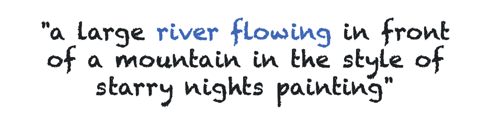
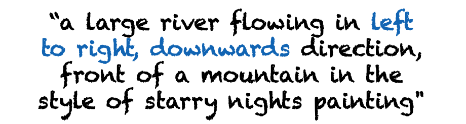
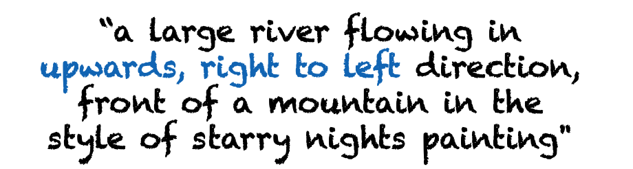
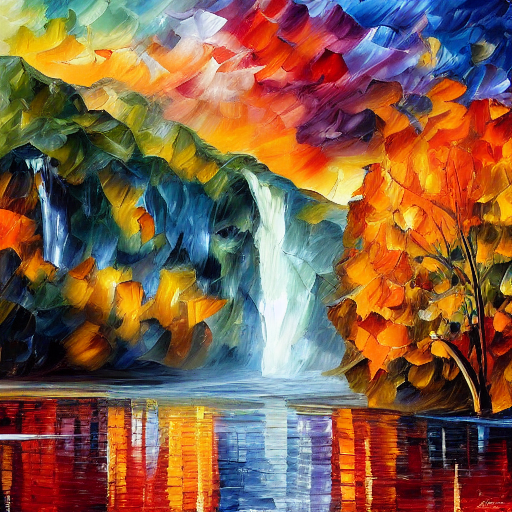
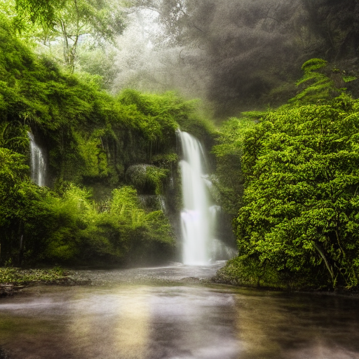
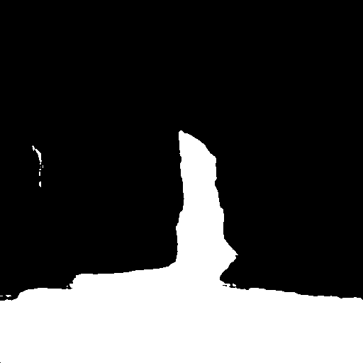
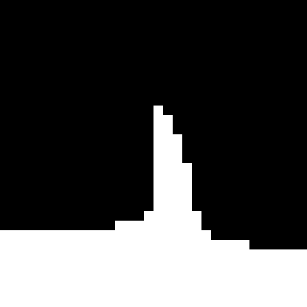
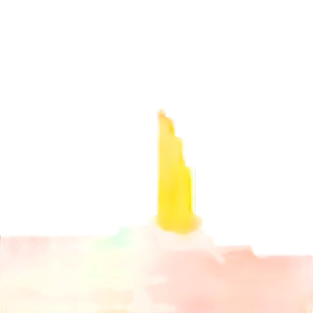

# Text2Cinemagraph

### [**paper**](https://arxiv.org/abs/2307.03190) | [**website**](https://text2cinemagraph.github.io/website/)

<!-- ### [**website**](https://text2cinemagraph.github.io/website/) -->

This is the official PyTorch implementation of "Text-Guided Synthesis of Eulerian Cinemagraphs".

<br>
<div class="gif">
<p align="center">

</p>
</div>

## Method Details

<br>
<div class="gif">
<p align="center">

</p>
</div>

We introduce a fully automated method, Text2Cinemagraph, for creating cinemagraphs from text descriptions - an especially challenging task when prompts feature imaginary elements and artistic styles, given the complexity of interpreting the semantics and motions of these images. In this method, we propose an idea of synthesizing image twins from a single text prompt using [Stable Diffusion](https://github.com/CompVis/stable-diffusion) - a pair of an artistic image and its pixel-aligned corresponding natural-looking twin. While the artistic image depicts the style and appearance detailed in our text prompt, the realistic counterpart greatly simplifies layout and motion analysis. Leveraging existing natural image and video datasets, we accurately segment the realistic image and predict plausible motion given the semantic information. The predicted motion is then transferred to the artistic image to create the final cinemagraph. 

## Getting Started

**Environment Setup**
- Run the following commands to set up the dependencies  reqiured for this project.
  ```
  git clone https://github.com/text2cinemagraph/artistic-cinemagraph.git
  cd text2cinemagraph
  conda create -n t2c python=3.9
  conda activate t2c
  conda install pytorch=1.13.1 torchvision=0.14.1 pytorch-cuda=11.6 -c pytorch -c nvidia
  conda install -c "nvidia/label/cuda-11.6.1" libcusolver-dev
  conda install -c conda-forge gxx_linux-64=11.2
  pip install git+https://github.com/NVlabs/ODISE.git
  pip install -r requirements.txt
  conda install -c anaconda cupy
  ```
  If there are `ninja` related errors in installing `mask2former` refer to this [link](https://github.com/NVlabs/ODISE/issues/19)

**Download Pretrained Models**
- Run the following command to download the preatrined (Optical Flow Prediction, Text-Direction Guided Optical Flow Prediction, Video Generation) models,
  ```
  gdown https://drive.google.com/u/4/uc?id=1Cx64SC12wXzDjg8U0ujnKx8V2G6SbCIb&export=download
  tar -xvf checkpoints.tar
  ```
- Download `sd-v1-4-full-ema.ckpt` using,
  ```
  mkdir -p img2img/models/ldm/stable-diffusion-v1
  cd img2img/models/ldm/stable-diffusion-v1
  wget https://huggingface.co/CompVis/stable-diffusion-v-1-4-original/resolve/main/sd-v1-4-full-ema.ckpt
  cd ../../../../
  ```
- Download [diffusers](https://github.com/huggingface/diffusers) `stable-diffusion-v1-4`
  ```
  cd checkpoints
  git lfs install
  git clone https://huggingface.co/CompVis/stable-diffusion-v1-4
  cd ../
  ```
  If there are issues with installing `git-lfs` refer to this [issue](https://github.com/text2cinemagraph/artistic-cinemagraph/issues/1)

**Inference (Artistic Domain)**

<!-- <br>
<div class="gif">
<p align="center">

</p>
</div> -->

|   |   |   |
| ------------- | ------------- | ------------- |
|   |   |    |

- To generate the first result from above exmaple, run the following command,
  ```
  python inference_t2c.py --config configs/inference.yaml
  ```

<!-- <br>
<div class="gif">
  <p align="center" style="margin-bottom: -7px;">
    &nbsp;&nbsp;&nbsp;&nbsp;&nbsp;&nbsp;&nbsp;
  </p>
  <p align="center">
    &nbsp;&nbsp;&nbsp;&nbsp;&nbsp;&nbsp;&nbsp;
  </p>
</div> -->

|   |   |
| ------------- | ------------- |
|   |   |


- To generate the text guided direction result displayed above, run the following command,
  ```
  #to generate the left example
  python  inference_t2c.py \
            --config configs/inference_directional.yaml \
            --use_hint \
            --prompt "a large river flowing in left to right, downwards direction in front of a mountain in the style of starry nights painting"

  #to generate the right example
  python  inference_t2c.py \
            --config configs/inference_directional.yaml \
            --use_hint \
            --prompt "a large river flowing in upwards, right to left direction in front of a mountain in the style of starry nights painting"
  ```
  Note that since we randomly sample a `theta` based on quadrant which the text direction corresponds to, exact replicability might not be possible.

| Artistic Image (`s1`)  | Natural Image (`s21`) | ODISE Mask (`s3`) |
| ------------- | ------------- | ------------- |
|   |   |  |

| Self-Attention Mask (`s4`) | Optical Flow (`s5`) | Cinemagraph (`s6`)
| ------------- | ------------- | ------------- |
|  |  |  |

- Since the total time needed to run all the components might be large and the user might not be satisfied with the end result due to output of some intermediate compont, we suggest the user to run each component separately in such scenario. Below we show how to run inference in a  stage-wise manner,
  ```# Generate the artistic image and save internal features
  python inference_t2c.py --config configs/inference.yaml --stage s1

  # Generate the twin (natural) image
  python inference_t2c.py --config configs/inference.yaml --stage s2

  # Generate ODISE mask
  python inference_t2c.py --config configs/inference.yaml --stage s3

  # Generate Self-Attention mask (guided using ODISE mask)
  python inference_t2c.py --config configs/inference.yaml --stage s4

  # Predict optical flow
  python inference_t2c.py --config configs/inference.yaml --stage s5

  # Generate the cinemagraph
  python inference_t2c.py --config configs/inference.yaml --stage s6
  ```

**Tip and Tricks for achieving better results (Artistic Domain)** 
<br><br>Change the following parameters in `inference.yaml` or `inference_directional.yaml` if you do not achieve desired results,
  - `twin_extraction:prompt`: change the input text prompt if the images generated by `--stage s1` are not desirable.
  - `twin_extraction:seed`: change the seed if the images generated by `--stage s1` are not desirable and the user does not want to change the prompt.
  - `twin_generation:prompt`: by default it can be `None`. If the output of `--stage s2` does not look semantically similar to the artistic image, try spacifying the edit prompt manually.
  - `odise:vocab`: if the ODISE generated mask is including some regions that the user does not want, change the `vocab` to specify only the desired regions.
  - `attn_mask:n_clusters`: change the number of clusters if the generated mask from `--stage s4` is not representative of the desired regions of motion in the final cinemagraph.
  - `attn_mask:threshold`: it specifies what is the minimum percentage of pixel overlap between the ODISE mask and the Self-Attention cluster to be considered inside the mask. Increase the value to reduce the amount of Self-Attention clusters included in the final mask and vice versa.
  - `attn_mask:cluster_type`: change the cluster type between `kmeans` or `spectral` (this is only for very fine-grained refinement).
  - `attn_mask:erosion_iter`: if the mask is slightly overlaping with boundaries of static region in `--stage s4` increase the value of `erosion_iter` between `[2,5]` at intervals of `1` to retract the mask slightly.
  - `video:n_frames`: use  `60` in cases of motion restricted to small regions (like waterfall) and `120` for large body motion (like sea).
  - `video:speed`: change the speed (recommended value between `[0.25, 3]`) to change the speed of motion in the generated cinemagraph. If the user notices `grey rigions` apprearing in the cienmagraph, try lowering the speed.


## Data Preparation for Training

**Optical Flow and Videos**
- The dataset for ground-truth optical flows and videos are taken from [Animating Pictures with Eulerian Motion Fields](https://eulerian.cs.washington.edu/dataset/). Download the train and validation dataset using,
  ```
  gdown https://drive.google.com/u/0/uc?id=19f2PsKEaeAmspd1ceGkOEMhZsZNquZyF&export=download
  cd dataset
  unzip eulerian_data.zip
  ```
  Note that we use the entire validation dataset as test dataset (and do not use it during training process).

**Masks (ODISE)**
- For testing on real-domain data, we use masks generated by [ODISE](https://github.com/NVlabs/ODISE). To generate the masks (after completing the above step), run the following command,
  ```
  python demo/gen_mask.py \
            --input dataset/eulerian_data/validation \
            --output dataset/eulerian_data/validation_masks_odise \
            --vocab "water, waterfall, river, ocean, lake, sea"
  ```

**Text Guided Direction Control**
- For training the optical flow prediction model that can predict flow following the direction of motion in the input prompt, we generate optical dense flow hint maps, similar to [Controllable Animation of Fluid Elements in Still Images](https://controllable-cinemagraphs.github.io/). The optical flow hints are generated from Ground-Truth optical flow with 1,2,3,4 and 5 hints. The code for generating hints is taken from [SLR-SFS](https://github.com/simon3dv/SLR-SFS/tree/main).
  ```
  python dataset/generate_flow_hint.py \
            --dataroot dataset/eulerian_data/train \
            --save_path dataset/eulerian_data/train_motion_hints \
            --n_clusters 5
  ```

**Artistic Domain Prompts**
- The prompts used to generate artistic domain examples are located in `dataset/prompts.txt` and the corresponding edit prompts (used to generate the natural verion of the artistic images) are located in `dataset/prompts_twin.txt`. 
Note that the edit prompts can be specified manually or can also be atumatically derived from the artistic prompts if not specified otherwise.

## Training

**Optical Flow Prediction**
- For training the optical flow prediction model, that predicts optical flow without taking text direction guidance, use the following command,
  ```
  python train_motion.py \
            --name <expriment-name-1> \
            --gpu_ids 0,1,2,3 \
            --no_instance \
            --label_nc 0 \
            --input_nc 4 \
            --output_nc 2 \
            --fineSize 512 \
            --batchSize 16 \
            --norm instance \
            --dataset_name motion \
            --motion_norm 64.0 \
            --netG spadexattnunetsd \
            --dataroot dataset/eulerian_data/train \
            --no_vgg_loss \
            --use_epe_loss \
            --use_prompts \
            --use_mask \
            --mask_path dataset/eulerian_data/train_masks_odise \
            --captions_file ./dataset/captions/file2captions-eularian-train-blip2-20-15.txt
  ```

  Note that in addition to the input image and mask, we condition the flow prediction  on text prompt. We generate the text prompts for the images in the train and validation dataset using [BLIP2](https://github.com/salesforce/LAVIS/tree/main/projects/blip2).

**Optical Flow Prediction (for text guidance direction)**
- For training the optical flow prediction model, that predicts optical flow conditioned on text direction guidance, use the following command,
  ```
  python train_motion.py \
            --name <expriment-name-2> \
            --gpu_ids 0,1,2,3 \
            --no_instance \
            --label_nc 0 \
            --input_nc 6 \
            --output_nc 2 \
            --fineSize 512 \
            --batchSize 16 \
            --norm sync:spectral_instance \
            --dataset_name motion \
            --motion_norm 64.0 \
            --netG spadeunet \
            --dataroot dataset/eulerian_data/train \
            --no_vgg_loss \
            --use_epe_loss \
            --use_mask \
            --mask_path dataset/eulerian_data/train_masks_odise \
            --use_hint \
            --hints_path dataset/eulerian_data/train_motion_hints
  ```

  Note that in our experiments, for predicting optical flow conditioned on text direction guidance, we do not use text conditoning by Cross-Attention layers, as the input consists of the image, mask and dense optical flow hint. The motivation for using text conditioning along with image and mask in previous method was that text inherently contains class information, like a ‘waterfall’ or ‘river’, which can be useful to determine the natural direction in the predicted flow. However, in this case direction is already given as input dense flow hint. This helps in reducing the model size (as we do not need to use expensive Cross-Attention layers).

**Video Generation**
- For first stage training (training using Ground-Truth Optical Flow) of the video generation model, use the following command,
  ```
  python train_video.py \
            --name <expriment-name-3> \
            --gpu_ids 0,1,2,3 \
            --no_instance \
            --label_nc 0 \
            --input_nc 8 \
            --output_nc 3 \
            --fineSize 512 \
            --batchSize 16 \
            --norm_G sync:spectral_instance \
            --dataset_name frame \
            --netG spadeunet4softmaxsplating \
            --dataroot dataset/eulerian_data/train \
            --use_l1_loss \
            --tr_stage stage1 \
            --frames_basepath dataset/eulerian_data/train
  ```

- We train the flow perdiction model additionally for 50 epochs on optical flow predicted by the Optical Flow Prediction model. To make the training process more efficient, we precompute and store all the optical flow predictions for training data before starting training. To generate the optical flow using the Optical Flow Prediction model use the following command,
  ```
  python test_motion.py \
            --<expriment-name-1> \
            --phase train \
            --no_instance \
            --label_nc 0 \
            --input_nc 4 \
            --output_nc 2 \
            --fineSize 512 \
            --batchSize 1 \
            --which_epoch 200 \
            --netG spadexattnunetsd \
            --dataroot dataset/eulerian_data/train \
            --use_mask \
            --use_prompts \
            --captions_file ./dataset/captions/file2captions-eularian-train-blip2-20-15.txt
  ```

- For second stage training (training using Optical Flow predicted by model) of the video generation model, use the following command,
  ```
  python train_video.py \
            --name <experiment-name-3> \
            --continue_train \
            --niter 150 \
            --gpu_ids 0,1,2,3 \
            --no_instance \
            --label_nc 0 \
            --input_nc 8 \
            --output_nc 3 \
            --fineSize 512 \
            --batchSize 16 \
            --norm_G sync:spectral_instance \
            --dataset_name frame \
            --netG spadeunet4softmaxsplating \
            --dataroot dataset/eulerian_data/train \
            --use_l1_loss \
            --tr_stage stage2 \
            --frames_basepath dataset/eulerian_data/train \
            --motion_basepath results/motion-7-1/train_200/images \
            --motion_norm 64.0
  ```
  Note that we use the Video Generation model, trained with Optical Flow Prediction model (w/o using text direction guidance) to generate videos for both the scenarios, i.e., w/ and w/o text direction guidance.

## Evaluation (Real Domain)

**Generate Results**
- To predict Optical Flow for the validation dataset on single images, use the following command,
  ```
  python test_motion.py \
            --name <experiment-name-1> \
            --no_instance \
            --label_nc 0 \
            --input_nc 4 \
            --output_nc 2 \
            --fineSize 512 \
            --batchSize 1 \
            --netG spadexattnunetsd \
            --dataset_name motion \
            --dataroot dataset/eulerian_data/validation \
            --use_mask \
            --use_seg_mask \
            --use_prompts \
            --mask_path dataset/eulerian_data/validation_masks_odise \
            --captions_file dataset/captions/file2captions-eularian-validation-blip2-20-15.txt
  ```
  Note that to predict optical flows in using our pretrained models, after downloading the models, replace `<experiment-name-1>` with `motion-pretrained`.
- To generate cinemagraphs using the predicted optical flows, in previous step, for the validation dataset, use the following command,
  ```
  python test_video.py \
            --name<experiment-name-3> \
            --no_instance \
            --label_nc 0 \
            --input_nc 8 \
            --output_nc 3 \
            --fineSize 512 \
            --batchSize 1 \
            --dataset_name frame \
            --netG spadeunet4softmaxsplating \
            --dataroot dataset/eulerian_data/validation \
            --motion_basepath results/<experiment-name-1>/test_latest/images \
            --speed 1.0
  ```
  Note that to generate cinemagraphs in using our pretrained models, after downloading the models, replace `<experiment-name-3>` with `video-pretrained`.

**Compute FVD on Real Domain Results**

- To predict `FVD_16`, where frames are samples at a `rate=3` (with total 16 frames sampled out of 60) use the following command,
  ```
  python evaluate/compute_fvd.py \
            --pred_path <generated-video-dir> \
            --gt_path dataset/eulerian_data/validation \
            --type fvd_16
  ```

- To predict `FVD_60`, where frames are samples at a `rate=1` (with all 60 frames samples) use the following command,
  ```
  python evaluate/compute_fvd.py \
            --pred_path <generated-video-dir> \
            --gt_path dataset/eulerian_data/validation \
            --type fvd_60
  ```

The code for `FVD` computation has been taken from [StyleGAN-V](https://github.com/universome/stylegan-v).

## Citation

``` bibtex
@article{mahapatra2023text,
    title={Text-Guided Synthesis of Eulerian Cinemagraphs},
    author={Mahapatra, Aniruddha and Siarohin, Aliaksandr and Lee, Hsin-Ying and Tulyakov, Sergey and Zhu, Jun-Yan},
    journal={arXiv preprint arXiv:2307.03190},
    year={2023}
}
```

## Acknowledgments

The code for this project was built using the codebase of [pix2pixHD](https://github.com/NVIDIA/pix2pixHD), [ODISE](https://github.com/NVlabs/ODISE), [plug-and-play](https://github.com/MichalGeyer/plug-and-play/tree/main), [SLR-SFS](https://github.com/simon3dv/SLR-SFS/tree/main). The `symmetric-splatting` code was built on top of [softmax-splatting](https://github.com/sniklaus/softmax-splatting). The code for evalution metric (`FVD`) was build on codebase of [StyleGAN-V](https://github.com/universome/stylegan-v). We are very thankful to the authors of the corresponding works for releasing their code.

We are also grateful to Nupur Kumari, Gaurav Parmar, Or Patashnik, Songwei Ge, Sheng-Yu Wang, Chonghyuk (Andrew) Song, Daohan (Fred) Lu, Richard Zhang, and Phillip Isola for fruitful discussions. This work is partly supported by Snap Inc. and was partly done while Aniruddha was an intern at Snap Inc.
